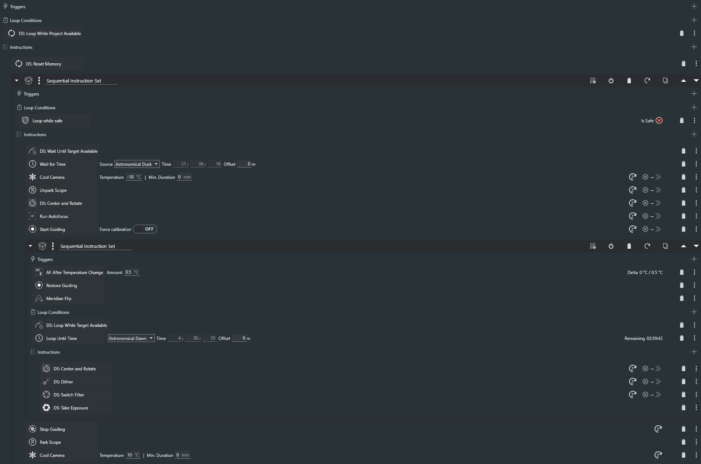

# DynamicSequencer
A plugin for [NINA](https://nighttime-imaging.eu) that dynamically selects an optimal target for imaging, allowing for unattended, multi-night, multi-target automated imaging.

When configured correctly, the plugin selects a target from the pool of targets defined by the user based on configurable criteria and interfaces seamlessly with the NINA advanced sequencer.

This plugin is heavily inspired by Tom Palmer's [Target Scheduler](https://tcpalmer.github.io/nina-scheduler/) Plugin and is very similar in nature. In fact, Dynamic Sequencer began as a private fork of Target Scheduler. However, the amount of changes made slowly grew until the point that it made more sense to completely rewrite it. Large sections of code were directly copied from Target Scheduler.

This plugin differs from Target Scheduler in two main aspects:
1. Targets are defined by JSON files, no graphical interface is available within NINA.
2. Individual sequencer instructions are provided instead of one large container (slew, take exposure, change filter vs. one  container that does everything).

This allows for further integration with other scripts that work with JSON, and allow for more granular control.

If you're looking for a more straightforward and plug-and-play solution, Target Scheduler may be better suited for your needs. But if you want more control, this plugin may work better.

> **DISCLAIMER**
> This plugin is in early stages of development and comes with absolutely no warranty. The author of this plugin is not responsible for any potential damage to equipment or lost imaging time. Use at your own risk.

## Getting Started

### **Create a Project**
1. Create a directory named `DynamicSequencerProjects` under the NINA application folder, usually `C:\Users\USER_NAME\AppData\Local\NINA`.
2. Create a JSON file in the `DynamicSequencerProjects` directory, it can have any name.
3. Edit the JSON file with the items from the following table, **all items are mandatory**:
> **WARNING** There are currently no checks for valid project JSON files built-in. All JSON files within the `DynamicSequencerProjects` directory are loaded by the plugin and assumed to be valid. No warnings may be generated and unexpected behavior may result from an invalid JSON file.

| Property | Type | Description | Example |
| --- | --- | --- | --- |
| name | string | Name of the project | `"M31"` |
| active | bool | Project is active when `true`. | `true` |
| priority | int | Project priority, lower number is higher priority. | `0` |
| ditherEvery | int | Amount of frames to take of each filter before dithering | `1` |
| minimumAltitude | double | Minimum altitude (in degrees) of a target for it to be considered. Set to `0` to disable. | `0` |
| horizonOffset | double | Minimum altitude (in degress) above the custom horizon  of a target for it to be considered. Disabled if no custom horizon file exists. | `5` |
| balanceTargets | bool | When set to `true`, the planner will prioritize the *least* completed target in a project, vice versa. This is helpful for balancing mosaic panels. Does nothing when only one target exists in the project. | `true` |
| centerTargets | bool | When set to `false`, `DS: Center and Rotate` will skip centering and will only slew then rotate. This may save some time if you have an accurate pointing model. | `true` |
| useMechanicalRotation | bool | When set to `true`, `DS: Center and Rotate` will save the mechanical rotator position and reuse it instead of platesolving and rotating every time. This saves some time and helps with repeatable flat frames. | `true` |
| takeFlats | bool | Marks the project for flat frames. This should be set to `false` in most cases. It will be automatically set to `true` by DS upon the completion of a project. Returns to `false` when flat frames are successfully taken. | `false` |
| flatAmount | int | Amount of flat frames to take, per filter, per target. | `30` |
| imageGrader.minStars | int | Minimum amount of stars for a frame to pass. | `100` |
| imageGrader.maxHFR | double | Maximum average star HFR (in pixels) for a frame to pass. | `2.0` |
| imageGrader.maxGuideError | double | Maximum guiding RMS error (in pixels) for a frame to pass. | `1.0` |
| targets | list | | |
| targets.name | string | Name of the target | `"Panel 1"` |
| targets.rightAscension | double | RA of the target in degrees, JNOW | `11.0029` |
| targets.declination | double | Dec of the target in degrees, JNOW | `41.3956` |
| targets.skyRotation | double | Sky orientation of the target in degrees. This is ignored when `useMechanicalRotation = true` and when there is a valid mechanical rotation value in `targets.mechanicalRotation` | `55` |
| targets.mechanicalRotation | double | Mechanical orientation of the rotator in degrees. When `useMechanicalRotation = true` and set to a value less than zero, the planner will attempt to figure out this value when this target is first selected and will save it to the json file for future use. All subsequent slews and rotates on this target will use this value. If there is a major change in the optical train that renders this value inaccurate, it may be reset by simply changing the value to a number below zero again. | `-1` |
| targets.balanceFilters | bool | When set to `true`, the planner will prioritize the *least* completed filter in the target, vice versa. Does nothing when only one filter exists. | `true` |
| targets.exposures | list | | |
| targets.exposures.filter | string | Name of filter, name must match the configured filter name on the filter wheel. | `"L"` |
| targets.exposures.exposureTime | double | Exposure time in seconds for the chosen filter. | `600` |
| targets.exposures.gain | int | Camera gain. | `100` |
| targets.exposures.offset | int | Camera offset. | `30` |
| targets.exposures.binning | int | Camera binning, 1 for 1x1, 2 for 2x2, etc. | `1` |
| targets.exposures.moonSeparationAngle | double | Moon separation angle in degrees for the Lorentzian curve. Valid range `0-180`. | `140` |
| targets.exposures.moonSeparationWidth | double | Moon separation width in days for the Lorentzian curve. Valid range `0-14`. | `10` |
| targets.exposures.requiredAmount | int | Amount of frames required. | `60` |
| targets.exposures.acceptedAmount | int | Amount of frames taken. This value is automatically updated by the plugin as more frames are taken. | `0` |

A valid project JSON file may look something like this:
```json
{
	"name": "M31",
	"active": true,
	"priority": 0,
	"ditherEvery": 1,
	"minimumAltitude": 0,
	"horizonOffset": 5,
	"balanceTargets": true,
	"centerTargets": true,
	"useMechanicalRotation": true,
	"takeFlats": false,
	"flatAmount": 30,
	"imageGrader": {
		"minStars": 100,
		"maxHFR": 2.0,
		"maxGuideError": 1.0
	},
	"targets": [
		{
			"name": "Panel 1",
			"rightAscension": 11.0029,
			"declination": 41.3956,
			"skyRotation": 55,
			"mechanicalRotation": -1,
			"balanceFilters": true,
			"exposures": [
				{
					"filter": "L",
					"exposureTime": 600,
					"gain": 100,
					"offset": 30,
					"binning": 1,
					"moonSeparationAngle": 140,
					"moonSeparationWidth": 10,
					"requiredAmount": 60,
					"acceptedAmount": 0
				},
				{
					"filter": "R",
					"exposureTime": 600,
					"gain": 100,
					"offset": 30,
					"binning": 1,
					"moonSeparationAngle": 140,
					"moonSeparationWidth": 10,
					"requiredAmount": 20,
					"acceptedAmount": 0
				},
				{
					"filter": "G",
					"exposureTime": 600,
					"gain": 100,
					"offset": 30,
					"binning": 1,
					"moonSeparationAngle": 140,
					"moonSeparationWidth": 10,
					"requiredAmount": 20,
					"acceptedAmount": 0
				},
				{
					"filter": "B",
					"exposureTime": 600,
					"gain": 100,
					"offset": 30,
					"binning": 1,
					"moonSeparationAngle": 140,
					"moonSeparationWidth": 10,
					"requiredAmount": 20,
					"acceptedAmount": 0
				},
				{
					"filter": "Ha",
					"exposureTime": 1200,
					"gain": 100,
					"offset": 30,
					"binning": 1,
					"moonSeparationAngle": 120,
					"moonSeparationWidth": 10,
					"requiredAmount": 30,
					"acceptedAmount": 0
				}
			]
		}
	]
}
```
### **Notes on Image Grading**
* Frames that are rejected do not increment the `acceptedAmount` field.
* There is no option to turn off image grading, it can be effectively disabled by setting the grading criteria such as `"minStars": 0`.
* Frames that are rejected are not deleted. Instead, the `Sequence Title` attribute of the frame metadata is edited to have `- REJECTED` at the end. If NINA is configured to include the `$$SEQUENCETITLE$$` attribute in the image file pattern setting, the image's name will change accordingly. For example, if a frame is usually saved as `M31/Panel 1/Ha_2000_01_01.fits`, a rejected frame will be `M31 - REJECTED/Panel 1/Ha_2000_01_01.fits`.

### **Configure the Advanced Sequencer**
All Dynamic Sequencer items can be identified by a name which starts with `DS:`. All the sequencer instructions and conditions from this plugin can be used in the same way as any other instruction from NINA.

#### `DS: Center and Rotate`
Slew, centers, and rotates to the optimal target. Current project and current target is saved in memory. The planning engine is "sticky", it will always prioritize the current project and current target if they are incomplete and available. This prevents the planner from bouncing back and forth between two or more targets, wasting valuable time. Will do nothing if the current target did not change. Behavior similar to vanilla NINA's `Slew, Center, and Rotate` can be achieved by setting `centerTargets = true` and `useMechanicalRotation = false`.

#### `DS: Reset Memory`
Clears memory of current project and current target. The planning engine will reselect the optimal target with no "stickiness" during the next run. This should be run at the end of every night. May be run more frequently if shooting mosaics.

#### `DS: Take Exposure`
Takes one exposure in accordance to the exposure plan selected by the planning engine.

#### `DS: Switch Filter`
Switches filter in accordance to the exposure plan selected by the planning engine.

#### `DS: Dither`
Sends a dither command to the guiding software when conditions are met. Configurable with the `ditherEvery` setting. This instruction will only send a dither command if the number of frames shot in *any filter* since the last dither/slew exceeds the setting. For example, when `ditherEvery = 1`, a series of frames may look something like this: `SHO'SHO'SHO` or `L'L'LRGB'L'L'LRGB`. Or when `ditherEvery = 2` it may look like: `SHOSHO'SHOSHO` or `LL'LRGBL'LLRGB'LL`.

#### `DS: Take Trained Flats`
Scans all projects for those marked for flat frames. Will only attempt to take flats for a particular project when all of the following prerequisites are met: `takeFlats = true`, `flatAmount` greater than zero, `useMechanicalRotation = true`, `target.mechanicalRotation` is a valid value, and trained flat presets are available for the specific filter, gain, and binning. The instruction will simply be skipped if any of the prerequisites are not met.

#### `DS: Wait Until Target Available`
Waits indefinitely until at least one target is returned from the planning engine. Note: the planning engine does not filter for sun altitude, so this should be used along with `Wait if Sun Altitude` or `Wait for Time`.

#### `DS: Loop While Target Available`
Loops indefinitely while at least one target is returned from the planning engine. Note: the planning engine does not filter for sun altitude, so this should be used along with `Loop Until Sun Altitude` or `Loop Until Time`.

#### `DS: Loop While Project Available`
Loops indefinitely while at least one project is active. Completed projects are automatically set to inactive.

An example sequence:


## Changelog
### v0.4.0.0
- Added `DS: Dither`
- Projects, targets, and exposures now have unique ids

### v0.3.1.0
- Fixed AF trigger issue with DynamicExposure

### v0.3.0.0
- Added image grader
- Fixed meridian flip timing issue

### v0.2.0.0
- Added `DS: Loop While Project Available`

### v0.1.0.0
- Added planning engine
- Added moon separation filter
- Added `DS: Center and Rotate`
- Added `DS: Reset Memory`
- Added `DS: Take Exposure`
- Added `DS: Switch Filter`
- Added `DS: Wait Until Target Available`
- Added `DS: Loop While Target Available`
